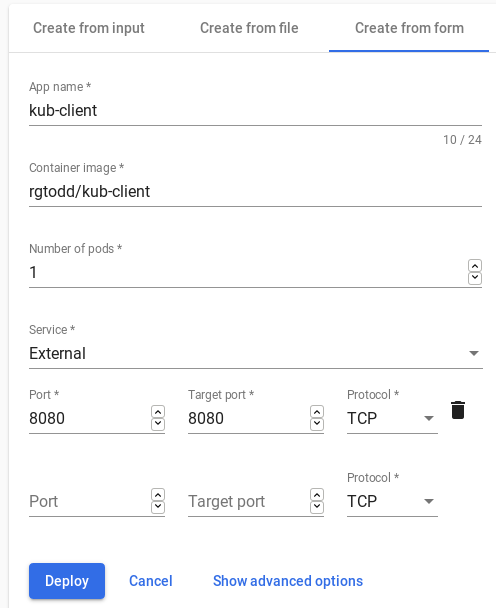
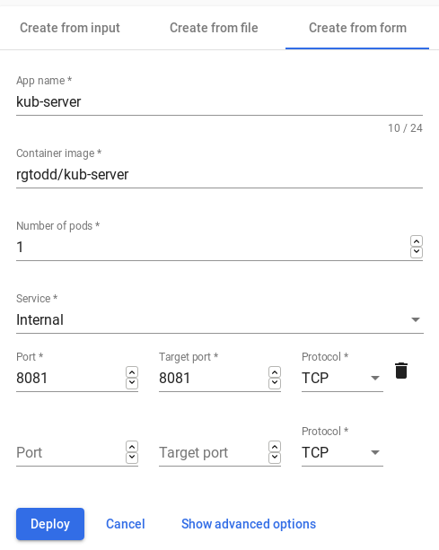

# Hello World REST Service Example

Simple example of calling a REST service.  Contains two programs:

* kub-server: Exposes a single REST service at /helloworld:8081

* kub-client: Consumes the REST data returned by kub-server and displays it to the user.

kub-client has three views.  They are identical except in the way the kub-server is called:

* local: Calls kub-server via http://localhost:8081/helloworld

* remote: Calls kub-server via http://kub-server:8081/helloworld

* config: Calls kub-server via http://<service.name>:8081/helloworld where <service.name> is determine by the service.name application property. 

In this document

* [Build the Applications](#build-the-applications)
* [Run Locally](#run-locally)
* [Run in Docker](#run-in-docker)
* [Install Minikube](#install-minikube)
* [Run in Minikube](#run-in-minikube)
* [Creating a ConfigSet](#creating-a-configset)

## Build the Applications

The code can be obtained by cloning the following GitHub repository:

```
https://github.com/rgtodd/gcp-practice.git
```

Both kub-client and kub-server can be built using the following Maven commands:

```
cd ~/git/gcp-practice/kub-client
mvn clean package 

cd ~/git/gcp-practice/kub-server
mvn clean package
```

**NOTE**

:point_right: The example above assumes ~/git is your local Git repository.

When complete, the following JAR files should exist:

* ~/git/gcp-practice/kub-client/target/kub-client-0.0.1-SNAPSHOT.jar
* ~/git/gcp-practice/kub-server/target/kub-server-0.0.1-SNAPSHOT.jar

## Run Locally

To run the program locally, open a terminal window and run the following program:

```
java -jar ~/git/gcp-practice/kub-client/target/kub-client-0.0.1-SNAPSHOT.jar
```

In a second window, run the following program:

```
java -jar ~/git/gcp-practice/kub-server/target/kub-server-0.0.1-SNAPSHOT.jar
```

In a web browser, open the following URL:

```
http://localhost:8081/helloworld
```

You should see output like the following:

```json
{"message":"Hello world!","dateTime":"2020-01-28T08:27:33.859","hostName":"centos","hostAddress":"10.0.2.15","exception":null}
```

This confirms the server program is successfully handling REST service calls.

Then, open the following URL:

```
http://localhost:8080/local
```

You should see output like the following:

<div class="bg-blue-light">
	<h1>Hello Local</h1>
	<p>Calls a REST service on localhost using a hard-coded URL.</p><h2>Local</h2>
	<p>
		Message: <span>Hello world!</span>
	</p><p>
		Local Date/Time: <span>2020-01-28T08:41:03.848</span>
	</p><p>
		Host Name: <span>centos</span>
	</p><p>
		Host Address: <span>10.0.2.15</span>
	</p><p>
		Exception: <span></span>
	</p><h2>Remote</h2>
	<p>
		URL: <span>http://localhost:8081/helloworld</span>
	</p><p>
		Message: <span>Hello world!</span>
	</p><p>
		Local Date/Time: <span>2020-01-28T08:41:03.850</span>
	</p><p>
		Host Name: <span>centos</span>
	</p><p>
		Host Address: <span>10.0.2.15</span>
	</p><p>
		Exception: <span></span>
</p>
</div>

This page indicates that kub-client has successfully called kub-server using the hard-coded link http://localhost:8081/helloworld.

Now, open the link:

```
http://localhost:8080/config
```

You should see a similar page.  However, the server name is now determined by the following entry in the **application.properties** resource file:

```
service.name = localhost
```

## Run in Docker

Run the following commands to build Docker images for the programs:

```
docker build -t kub-client ~/git/gcp-practice/kub-client/.
docker build -t kub-server ~/git/gcp-practice/kub-server/.
```

Create a user-defined network that will allow the two containers to communicate with each other:

```
docker network create kub-network
```

Create containers for each of the docker images:

```
docker create --name kub-client --network kub-network --publish 8080:8080 kub-client
docker create --name kub-server --network kub-network kub-server
```

These containers can then be started:

```
docker start kub-client
docker start kub-server
```

Open the following URL in a browser window:

```
http://localhost:8080/remote
```

The following page will be shown:

<div background="lightyellow">
	<h1>Hello Server</h1>
	<p>Calls a REST service on kub-server using a hard-coded URL.</p><h2>Local</h2>
	<p>
		Message: <span>Hello world!</span>
	</p><p>
		Local Date/Time: <span>2020-01-28T15:57:44.517</span>
	</p><p>
		Host Name: <span>f10cb55556cf</span>
	</p><p>
		Host Address: <span>172.19.0.2</span>
	</p><p>
		Exception: <span></span>
	</p><h2>Remote</h2>
	<p>
		URL: <span>http://kub-server:8081/helloworld</span>
	</p><p>
		Message: <span>Hello world!</span>
	</p><p>
		Local Date/Time: <span>2020-01-28T15:57:44.674</span>
	</p><p>
		Host Name: <span>2e8e3d2fe048</span>
	</p><p>
		Host Address: <span>172.19.0.3</span>
	</p><p>
		Exception: <span></span>
</p>
</div>

When complete, stop the docker containers:

```
docker stop kub-client
docker stop kub-server
```

## Install Minikube

Minikube is a single-node Kubernetes cluster that can be used on local development machines.  Installation instructions can be found at https://kubernetes.io/docs/tasks/tools/install-minikube/.

Once installed, start Minikube and launch the dashboard using:

```
minikube dashboard
```

## Run in Minikube

In order to consume the Docker images in a Kubernetes environment, they should be published to a image repository.

**NOTE**

:point_right: Alternatively, Minikube allows docker to directly interact with the docker daemon hosted by Kubernetes.  See https://kubernetes.io/docs/setup/learning-environment/minikube/ for more information.

If you do not have an account on Docker Hub, go to https://hub.docker.com/ and create one.
 
Then, tag your images appropriately:

```
docker tag kub-client <userId>/kub-client
docker tag kub-server <userId>/kub-server

```

**NOTE**

:point_right: Replace &lt;userId&gt; with your Docker Hub user ID.

You can then push your images to the repository:

```
docker push <userId>/kub-client
docker push <userId>/kub-server
```

You can deploy your images by clicking the + icon on the top menu bar.

Deploy kub-client by clicking on the **Create from form** tab and entering the following options:



These service options cause a LoadBalancer service to be created.  This service allows the user to access the client application from their web browser.   

Deploy kub-server with the following options:



These service options cause a ClusterIP service to be created for port 8081.  Mihikube creates the service with the same name as the application - kub_server.  This is the service name specified by kub-client.

Use the following command to obtain the external IP address of the kub-client service:

```
minikube service kub-client
```

The command will print the service details.  For example:

```
|-----------|------------|---------------------|-----------------------------|
| NAMESPACE |    NAME    |     TARGET PORT     |             URL             |
|-----------|------------|---------------------|-----------------------------|
| default   | kub-client | tcp-8080-8080-8ds29 | http://192.168.99.101:31170 |
|-----------|------------|---------------------|-----------------------------|
```

It will also automatically open the URL in your browser.  Update the URL to specify the remote page.  For example:

```
http://192.168.99.101:31170/remote
```

The following page will be shown:

<div background="lightyellow">
<h1>Hello Server</h1>
	<p>Calls a REST service on kub-server using a hard-coded URL.<h2>Local</h2>
	<p>
		Message: <span>Hello world!</span>
	<p>
		Local Date/Time: <span>2020-01-28T23:56:21.816</span>
	<p>
		Host Name: <span>kub-client-6b8cff9468-qjpq2</span>
	<p>
		Host Address: <span>172.17.0.3</span>
	<p>
		Exception: <span></span>
	<h2>Remote</h2>
	<p>
		URL: <span>http://kub-server:8081/helloworld</span>
	<p>
		Message: <span>Hello world!</span>
	<p>
		Local Date/Time: <span>2020-01-28T23:56:24.091</span>
	<p>
		Host Name: <span>kub-server-7f87657b4-f2nwq</span>
	<p>
		Host Address: <span>172.17.0.4</span>
	<p>
		Exception: <span></span>
</div>

## Creating a ConfigSet

When we ran the program locally, the **config** page determined the name of the REST server using the following **application.properties** resource file entry: 

```
service.name = localhost
```

We can modify the behavior of the **config** page by creating a ConfigSet that overrides this value. 

Use the following command to verify that kubectl is  configured to target your Minikube environment:

```
kubectl config get-contexts
```

All registered Kubernetes clusters will be listed:


```
CURRENT   NAME                                                        CLUSTER                                                     AUTHINFO                                                    NAMESPACE
          gke_rgt-cloud-training_us-central1-a_your-first-cluster-1   gke_rgt-cloud-training_us-central1-a_your-first-cluster-1   gke_rgt-cloud-training_us-central1-a_your-first-cluster-1   
*         minikube                                                    minikube                                                    minikube                                                    
          virtualbox                                                  virtualbox                                                  virtualbox                                                  

```

If minikube is not the current context, switch to it using the following command:

```
kubectl config use-context minikube
```

The YAML file kub-client-configmap.yaml contains a ConfigMap definition:

``` yaml
kind: ConfigMap
apiVersion: v1
metadata:
  name: kub-client
  namespace: default
data:
  application.properties: service.name=kub-server
```

Apply this resource to your Minikube environment:

```
kubectl apply -f ~/git/gcp-practice/kub-client-configmap.yaml 
kubectl rollout restart Deployment kub-client
```

However, these changes will often not take affect.  Review the logs of the kub-client deployment:

```
kubectl logs deployment/kub-client
```

The following message indicates the service account associated with the kub-client service does not have access to the configmaps Kubernetes service:

```
io.fabric8.kubernetes.client.KubernetesClientException: Failure executing: GET at: https://10.96.0.1/api/v1/namespaces/default/configmaps/kub-client. Message: Forbidden!Configured service account doesn't have access. Service account may have been revoked. configmaps "kub-client" is forbidden: User "system:serviceaccount:default:default" cannot get resource "configmaps" in API group "" in the namespace "default".

```

The YAML file kub-client-role.yaml contains a new Role definition that provices access to this service:

```
apiVersion: rbac.authorization.k8s.io/v1
kind: Role
metadata:
  name: kub-client
rules:
- apiGroups:
  - ""
  resources:
  - services
  - pods
  - endpoints
  - namespaces
  - configmaps
  - secrets
  verbs:
  - get
  - list
  - watch
---
apiVersion: rbac.authorization.k8s.io/v1
kind: RoleBinding
metadata:
  name: kub-client
roleRef:
  apiGroup: rbac.authorization.k8s.io
  kind: Role
  name: kub-client
subjects:
- kind: ServiceAccount
  name: default
```

Apply this resource to the cluster: 

```
kubectl apply -f ~/git/gcp-practice/kub-client-role.yaml 
kubectl rollout restart Deployment kub-client
```

Accessing the **config** page should now display properly:

<div background="lightyellow">
	<h1>Hello Config</h1>
	<p>Calls a REST service using a configuration-based URL.<h2>Local</h2>
	<p>
		Message: <span>Hello world!</span>
	<p>
		Local Date/Time: <span>2020-01-29T01:10:38.038</span>
	<p>
		Host Name: <span>kub-client-87b956c6d-lrwp8</span>
	<p>
		Host Address: <span>172.17.0.4</span>
	<p>
		Exception: <span></span>
	<h2>Remote</h2>
	<p>
		URL: <span>http://kub-server:8081/helloworld</span>
	<p>
		Message: <span>Hello world!</span>
	<p>
		Local Date/Time: <span>2020-01-29T01:10:38.500</span>
	<p>
		Host Name: <span>kub-server-7f87657b4-f2nwq</span>
	<p>
		Host Address: <span>172.17.0.7</span>
	<p>
		Exception: <span></span>
</div>